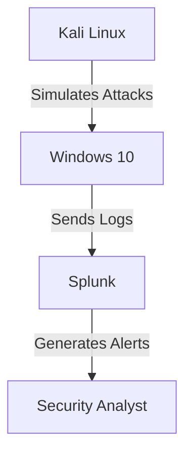

# Project-1-🎮 SOC Home Lab: A Cyber Battle Royale (Attack vs. Defense Edition) 🏴‍☠️
Welcome, fellow hacker (or defender?)! 🕵️‍♂️ Ever wanted to simulate an epic cyber battle between Kali Linux (the attacker) and Windows 10 (the victim) while Splunk (the cyber sheriff) watches everything? Well, buckle up! This project is your virtual cyber dojo where you’ll:

🏴‍☠️ Play the attacker (generate evil malware with msfvenom)

🛡️ Play the defender (hunt malicious activity with Splunk)

📊 Play the analyst (dig through logs like a digital detective)

Think of it as "Among Us" but for cybersecurity—except the impostor is a reverse shell, and Splunk is your security cam!

## 🚀 Mission Briefing 
**1. Attack Phase:**  Kali Linux sends malware to Windows 10.

**2. Defense Phase:** Windows logs everything with Sysmon.

**3. Detection Phase:** Splunk catches the attack like a boss.

**End Result?** You gain hands-on SOC experience without breaking any real laws!
## Table of Contents

1.<a href="#Prerequisites">Prerequisites</a>

2.<a href="#Network Topology">Network Topology</a>

3.<a href="#Phase 1: Deploying Your Cyber Warriors (VMs)">Phase 1: Deploying Your Cyber Warriors (VMs)</a>

4.<a href="#Step 2: Installing Splunk for Log Monitoring">Step 2: Installing Splunk for Log Monitoring</a>

5.<a href="#Step 3: Installing Sysmon on Windows 10">Step 3: Installing Sysmon on Windows 10</a>

6.<a href="#Step 4: Generating Malware with msfvenom">Step 4: Generating Malware with msfvenom</a>

7.<a href="#Step 5: Setting Up a Metasploit Listener">Step 5: Setting Up a Metasploit Listener</a>

8.<a href="#Step 6: Monitoring Logs with Splunk">Step 6: Monitoring Logs with Splunk</a>

9.<a href="#Troubleshooting">Troubleshooting</a>

10.<a href="#Next Steps & Future Improvements">Next Steps & Future Improvements</a>

11.<a href="#How to Contribute">How to Contribute</a>

12.<a href="#Conclusion">Conclusion</a>

<h2 id="Prerequisites">Prerequisites</h2> 
Before jumping into battle, you’ll need:

| Requirements | Why You Need It |
|--------------|-------------|
| **16GB+ RAM** | Because running 3 VMs on 4GB RAM is like trying to fight a dragon with a toothpick.|
| **VMware/VirtualBox** | Your virtual battleground. |
| **Kali Linux ISO** | The attacker’s weapon stash. |
| **Windows 10 ISO** | The innocent victim (soon to be pwned). |
| **Splunk Free** | Your all-seeing cyber eye. |
| **Sysmon** | Windows’ built-in spy camera. |

<h2 id="Network Topology">Network Topology</h2> 

    
<h2 id="⚡ Phase 1: Deploying Your Cyber Warriors (VMs)">⚡ Phase 1: Deploying Your Cyber Warriors (VMs)</h2> 

1️⃣ Kali Linux (The Hacker’s Playground)
Download Kali ISO (Download Kali Here) [https://www.kali.org/get-kali/#kali-platforms].

Install in VMware/VirtualBox.

Update your tools (because even hackers hate outdated exploits):
<h2 id="Step 2: Installing Splunk for Log Monitoring">Step 2: Installing Splunk for Log Monitoring</h2> 
<h2 id="Step 3: Installing Sysmon on Windows 10">Step 3: Installing Sysmon on Windows 10</h2> 
<h2 id="Step 4: Generating Malware with msfvenom">Step 4: Generating Malware with msfvenom</h2> 
<h2 id="Step 5: Setting Up a Metasploit Listener">Step 5: Setting Up a Metasploit Listener</h2> 
<h2 id="Step 6: Monitoring Logs with Splunk">Step 6: Monitoring Logs with Splunk</h2> 
<h2 id="Troubleshooting">Troubleshooting</h2> 
<h2 id="Next Steps & Future Improvements">Next Steps & Future Improvements</h2> 
<h2 id="How to Contribute">How to Contribute</h2> 
<h2 id="Conclusion">Conclusion</h2> 

